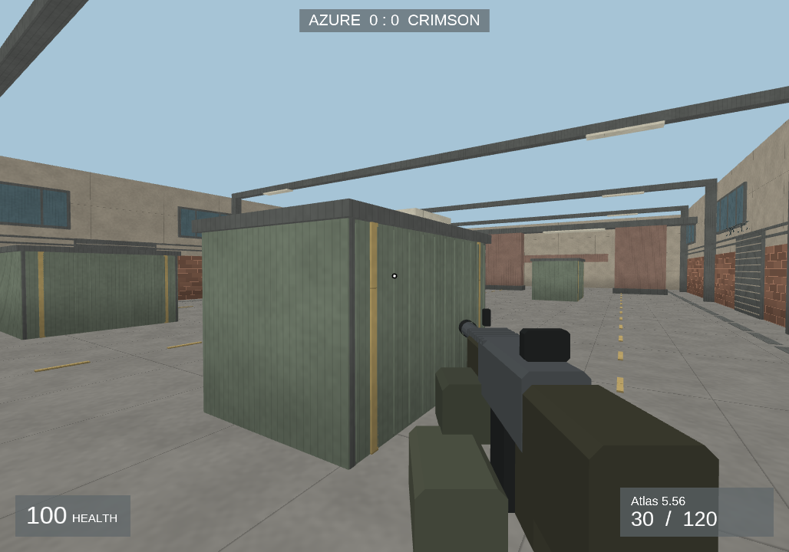

# BlueDM

BlueDM is a small, drop-in online team-deathmatch FPS prototype built on BlueEngine.
It uses the engine's reusable FPS module for its ten-weapon armory, deterministic
fire/reload timing, smooth aim-down-sights transition, operative archetypes, health,
teams, scoring, spawn protection, and respawns.



## Play locally

```powershell
cargo run --release --locked -- --host
```

This starts a local authoritative server thread and joins it. There are no bots in
this prototype; run a second client to test combat.

For a repeatable visual smoke capture, run `cargo run --release --locked -- --host --capture preview.png`.

## Play online or over a LAN

On the host machine:

```powershell
cargo run --release --locked --bin bluedm-server -- --listen 0.0.0.0:4100 --key YOUR_PRIVATE_KEY
```

Allow UDP port 4100 through the host firewall/router as appropriate. Each player runs:

```powershell
cargo run --release --locked -- --connect HOST_IP:4100 --key YOUR_PRIVATE_KEY
```

The prototype server uses a direct UDP join key and is intended for trusted friends
and LAN testing. It is not an account system, anti-cheat service, or DDoS-hardened
public service. BlueEngine's production QUIC/TLS profile remains the path for a later
internet-facing deployment.

## Controls

- WASD move; Shift sprint; Space jump; Ctrl crouch
- Mouse look; left mouse fire; right mouse smooth ADS; R reload
- 1-0 or mouse wheel selects any of the ten firearms
- Escape opens the game menu; F/F11 toggles fullscreen

## Content

- `maps/foundry.json`: validated eight-room, two-lane Cobalt Foundry arena
- `blueprints/foundry.blueprint.json`: editable source for the map
- Four procedural operative silhouettes: Vanguard, Recon, Breacher, Field Tech
- Ten procedural firearm/viewmodel styles backed by the BlueEngine armory

## Prototype boundaries

The vertical slice supports direct-IP multiplayer for up to eight players, server-
authoritative movement/combat, static-map occlusion, teams, health, kills/deaths,
respawns, ammunition, reloads, recoil/spread inputs, and ADS. It does not yet include
matchmaking, bots, voice chat, animation blending, imported skeletal meshes, accounts,
anti-cheat, or content download. Those are intentionally future milestones.

## Presentation update
F/F11 toggles fullscreen; Escape opens Resume / Controls / Quit. WASD and arrows move. Tab shows secondary stats and F3 shows diagnostics. Gameplay input is neutral while the menu is open; an online match continues. Host and server scripts use optimized builds.

Both the manifest and lockfile pin BlueEngine to commit `16acc82ddc3f934748ff5cf7e1f7a5ac74a289e3`. Cargo fetches that revision directly; a sibling engine checkout is not required.

The default map is maps/foundry-v2.json, a rebuilt industrial arena. maps/foundry.json is retained as the legacy reference. All four team spawn exits are covered by movement regression tests.

## Readability and movement revision
Shared immutable font atlas, beveled 3D weapon models, muzzle flash/recoil, shot audio,
tracers and wall impacts replace the old text and flat weapon blocks. Shot feedback is
cosmetic; damage remains server-owned. Local camera smoothing sweeps the collision
hull so presentation cannot extrapolate through map edges. This remains a low-poly
prototype, not a photorealistic asset pack. The client waits for the authoritative
spawn snapshot before sending look input, preserving the intended starting direction.

Movement: 5.8 m/s run, 8.0 m/s sprint, 2.5 m/s crouch. The 4096-byte snapshot budget covers all eight players; tests cover movement and ammo consumption over UDP.
