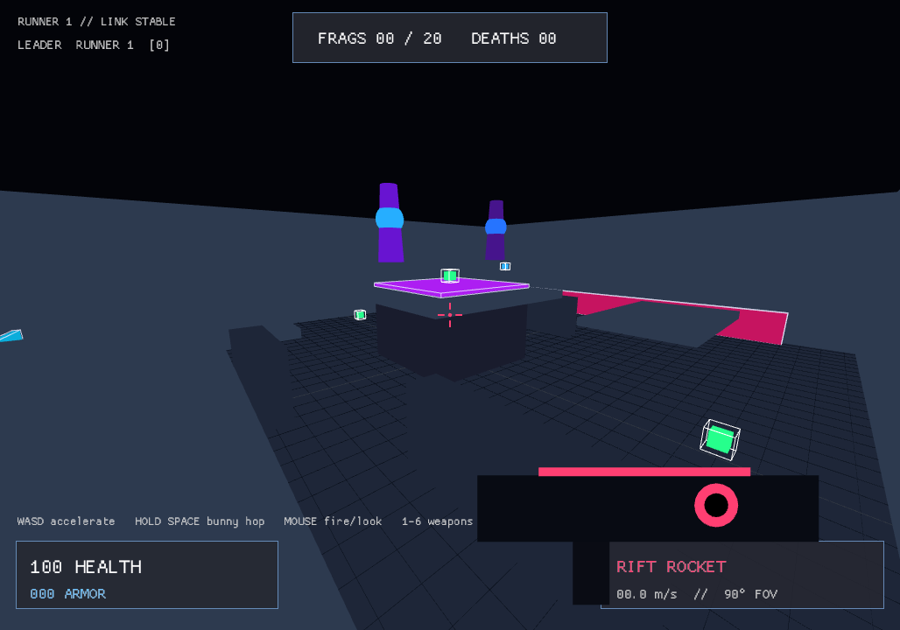

# Riftwake

Riftwake is a networked **hyperkinetic arena FPS** built on BlueEngine. Its movement
rewards conserved momentum and air steering; its three-level arena rewards route
knowledge, item timing, prediction and weapon control. The default view is exactly
90 degrees, with no sprint key or aim-down-sights slowdown to interrupt the flow.



## Play

```powershell
cargo run -- --host
```

That starts a local authoritative server and joins it. Open another terminal and run
`cargo run -- --connect 127.0.0.1:4200` for a second player.

For LAN/direct-IP play, the host runs:

```powershell
cargo run --bin riftwake-server -- --listen 0.0.0.0:4200 --key YOUR_PRIVATE_KEY
```

Each player runs `cargo run -- --connect HOST_IP:4200 --key YOUR_PRIVATE_KEY`.
UDP port 4200 must be allowed through the host firewall/router. The join key is for
trusted friend/LAN testing; it is not a public matchmaking or anti-cheat service.

## Controls

- WASD accelerates; hold Space to bunny hop immediately on landing
- Mouse looks and fires; 1-6 or wheel selects weapons
- Alt or Escape releases the mouse
- 90° FOV is the deliberate default and current competitive camera policy

## Arsenal

Ripper scattergun, Nailstorm, Grav Mortar, Rift Rocket, Arc Beam, and Void Rail cover
close burst, sustained tracking, arcing/splash pressure, prediction, and precision.
There are no reloads: the prototype keeps the focus on movement, selection and timing.

## The Fracture

The hand-authored duel arena has three elevations, a central mega-health power position,
two armor routes, two launch-pad shortcuts, broken rail sightlines and mirrored-but-not-
identical traversal. Neon edge bands and rift pylons make orientation immediate at speed.

## Prototype boundaries

The server owns movement, launch pads, hits, projectiles, splash, health/armor, pickups,
frag scoring and respawns for up to twelve direct-IP players. This slice does not yet
include bots, matchmaking, accounts, lag compensation, skeletal animation, content
downloads or public-server hardening. Those remain later milestones.
