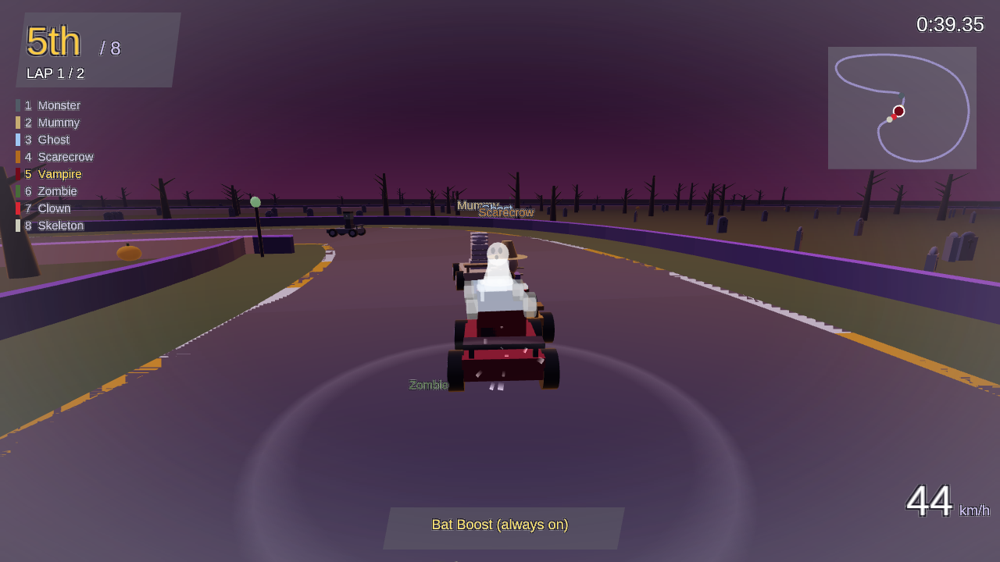
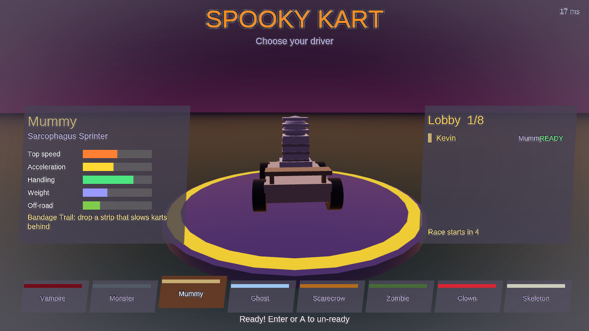

# Spooky Kart

A Halloween kart racer for up to eight players, built on [BlueEngine](https://github.com/kevstermcgee/BlueEngine).
Race one map, Haunted Hollow, as one of eight drivers, each with their own kart and signature perk. Play offline
against bots, or online on a dedicated server with friends (empty grid slots are filled with bots).

## Drivers

| Driver | Kart feel | Perk |
|---|---|---|
| Vampire | quick to accelerate | **Bat Boost**: drifts charge faster and boost harder |
| Frankenstein's Monster | heavy, fast at the top | **Ram**: bumps at speed launch lighter karts |
| Mummy | sharp handling | **Bandage Trail**: drop a strip that slows karts behind |
| Ghost | lightest, floaty | **Phase**: slip through karts, hazards and grass |
| Scarecrow | balanced | **Crow Swarm**: slow the nearest kart ahead |
| Zombie | sturdy, slow | **Undead**: shrug off grass, stuns wear off fast |
| Clown | tightest turns | **Honk**: shove nearby karts away |
| Skeleton | light, quick to accelerate | **Rattle**: drop bones that spin karts out |

## Controls

| | Keyboard | Controller |
|---|---|---|
| Gas / brake | W / S | right trigger (or A) / left trigger |
| Steer | A / D | left stick |
| Drift (hold through a corner, release to boost) | Shift | either bumper |
| Perk | Space | X |
| Menus | A / D, Enter; P: Play Online | D-pad or stick, A; Y: Play Online |
| Pause | Esc | Start |

## Play

Offline: run `spooky-kart` (or `spooky-kart --offline`). Online: on the select screen press **P** (or **Y** on a
controller) for **Play Online**: pick a room from the list (the Public room is always there), or **Create Room**, give it
a name and send your friends to Play Online > that name. `--hub HOST:PORT` (or a `hub.txt` next to the program, line 1)
points Play Online at another hub. To play on one particular server instead, put its address in a `server.txt` next to the
program (line 1 `host:port`, optional line 2 join key, optional line 3 `development` or `production`), or run
`spooky-kart --connect HOST:PORT [--transport production] [--join-key KEY]`. If the server is down, press Enter or O to
practise offline.

## Hosting

See [docs/HOSTING.md](docs/HOSTING.md). `spooky-kart-server` is one small process (about 1.5% of a core, under
4 MB) and records every race to `matches.jsonl`; `python tools/analyze.py` turns that into a per-character
balance table and a network report.

## Development

- [DESIGN.md](DESIGN.md): decisions and architecture. [STATUS.md](STATUS.md): what is done and what is next.
- [docs/ENGINE_LESSONS.md](docs/ENGINE_LESSONS.md): what building this taught us about BlueEngine.
- `cargo test --no-default-features`: the whole game logic and netcode, no window or network needed.
- `python tools/load_test.py`: bot clients against a real server over real UDP.
- The rules are a pure fixed-step simulation (`src/sim.rs`); the window (`src/main.rs`) only presents it.
